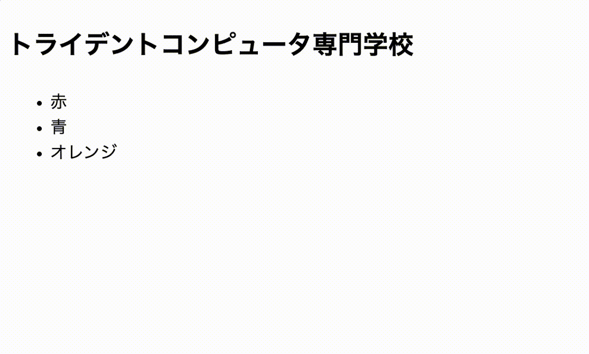

# JavaScriptクイズNEO①

このリポジトリは配布用です。  
Fork → branch → Pull Request で提出してください。

---

## 課題内容

下記の「見本」のように、色名が書かれたlistをクリックすると、トライデントコンピュータ専門学校の色が変わるようにしたJavaScriptを書いてください。



---

## 編集する場所

```html
index.html
```

以下の `<script>` の中だけを書いてください。

---

## 提出方法

### ① Fork
このリポジトリを自分のアカウントに Fork してください。

---

### ② clone
自分の Fork を GitHub Desktop で clone します。

---

### ③ branch を作る
ブランチ名に「quiz1/自分の名前」を記入する（例：quiz1/kawaguchi）

---

### ④ コードを書く
`index.html` を編集して課題を完成させます。

---

### ⑤ commit / push
変更を commit して push してください。

---

### ⑥ Pull Request を作成
元のリポジトリに向けて Pull Request を作成してください。

---

## 判定について

- Pull Request を出すと自動判定が実行されます
- 成功 → 緑
- 失敗 → 赤

※ コメントは付きません。  
※ 結果は「Checks」を確認してください。

---

## 注意

- `<script>` の外は変更しないでください
- HTML構造は変えないでください
- エラーが出たら修正して再度 push してください

---

## 模範解答

授業資料の一番下に、リンクがあります。
